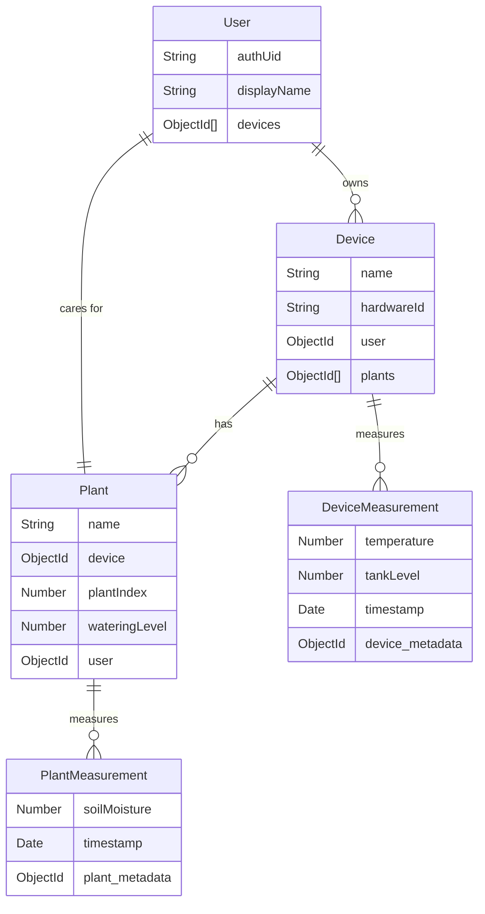

# Database entity relationship diagram

```mermaid

erDiagram
  Device ||--o{ Plant : "has"
  Device ||--o{ DeviceMeasurement : "measures"
  Plant ||--o{ PlantMeasurement : "measures"
  User ||--o{ Device : "owns"
  User ||--|| Plant : "cares for"

    Device {
      String name
      String hardwareId
      ObjectId user
      ObjectId[] plants
    }

    DeviceMeasurement {
      Number temperature
      Number tankLevel
      Date timestamp
      ObjectId device_metadata
    }

    Plant {
      String name
      ObjectId device
      Number plantIndex
      Number wateringLevel
      ObjectId user
    }

    PlantMeasurement {
      Number soilMoisture
      Date timestamp
      ObjectId plant_metadata
    }

    User {
      String authUid
      String displayName
      ObjectId[] devices
    }

```
