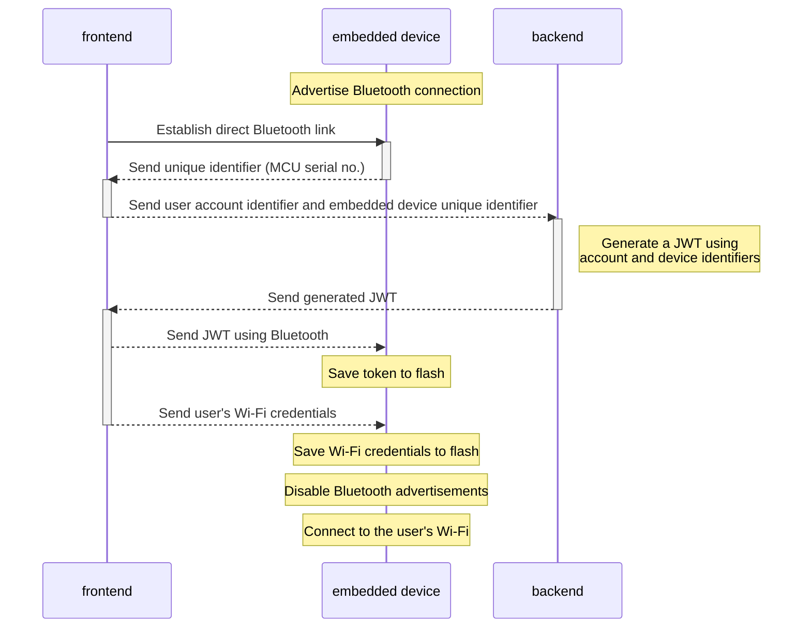

# Registering the Embedded Device

```mermaid

sequenceDiagram
participant frontend
participant embedded device
participant backend

    Note over embedded device: Advertise Bluetooth connection

    frontend->>embedded device: Establish direct Bluetooth link

    activate embedded device

    embedded device-->>frontend: Send unique identifier (MCU serial no.)

    deactivate embedded device

    activate frontend

    frontend-->>backend: Send user account identifier and embedded device unique identifier

    deactivate frontend

    activate backend

    Note right of backend: Generate a JWT using<br>account and device identifiers

    backend-->>frontend: Send generated JWT

    deactivate backend

    activate frontend

    frontend-->>embedded device: Send JWT using Bluetooth

    Note over embedded device: Save token to flash

    frontend-->>embedded device: Send user's Wi-Fi credentials

    deactivate frontend

    Note over embedded device: Save Wi-Fi credentials to flash

    Note over embedded device: Disable Bluetooth advertisements

    Note over embedded device: Connect to the user's Wi-Fi


```
