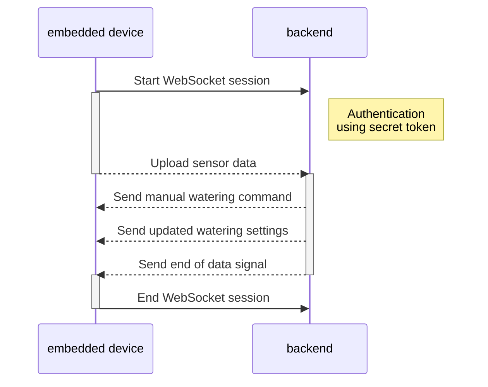

# WebSocket Functionality

```mermaid

sequenceDiagram
participant embedded device
participant backend

    embedded device->>backend: Start WebSocket session
    activate embedded device
    Note right of backend: Authentication<br>using secret token
    embedded device-->>backend: Upload sensor data
    deactivate embedded device
    activate backend
    backend-->>embedded device: Send manual watering command
    backend-->>embedded device: Send updated watering settings
    backend-->>embedded device: Send end of data signal
    deactivate backend
    activate embedded device
    embedded device->>backend: End WebSocket session
    deactivate embedded device

```
