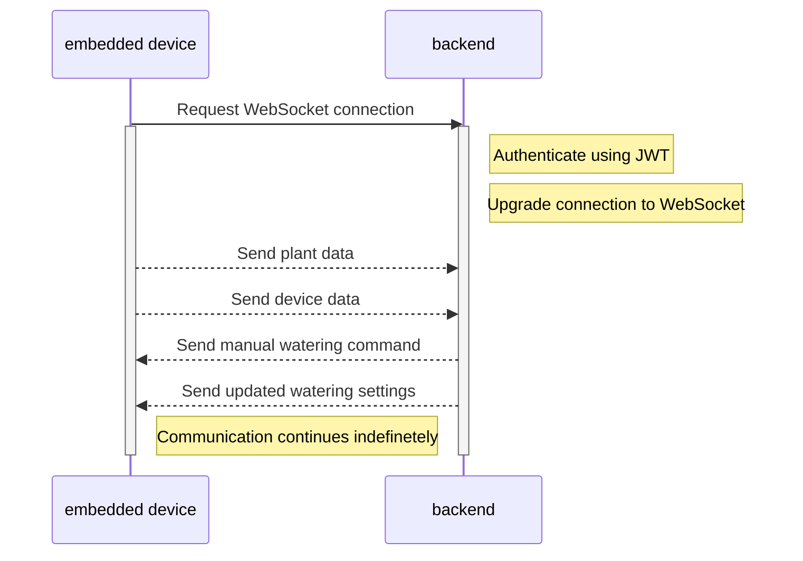

# WebSocket Functionality

```mermaid

sequenceDiagram
participant embedded device
participant backend

    embedded device->>backend: Request WebSocket connection
    activate embedded device
    activate backend
    Note right of backend: Authenticate using JWT
    Note right of backend: Upgrade connection to WebSocket
    embedded device-->>backend: Send plant data
    embedded device-->>backend: Send device data
    backend-->>embedded device: Send manual watering command
    backend-->>embedded device: Send updated watering settings


    Note left of backend: Communication continues indefinetely

    deactivate embedded device
    deactivate backend
```
